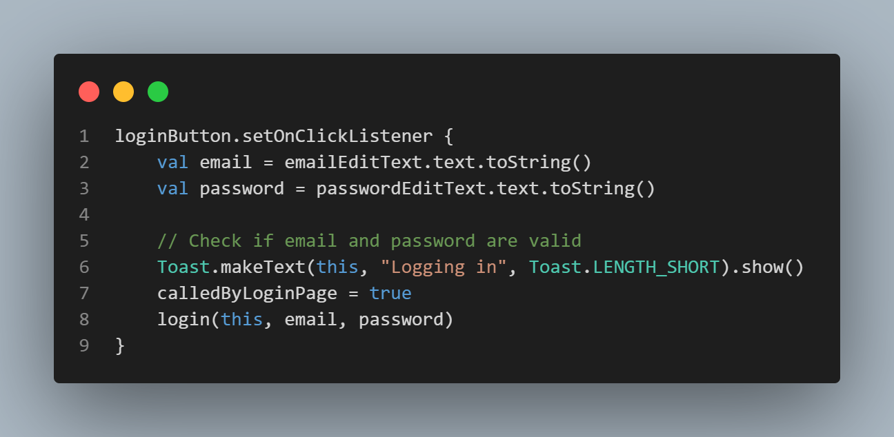
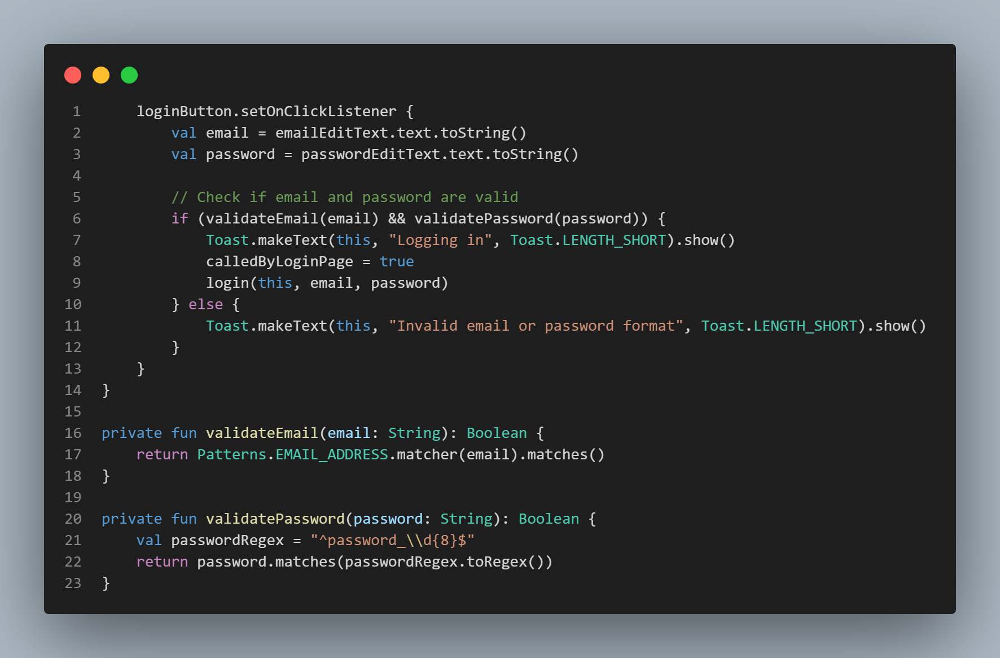
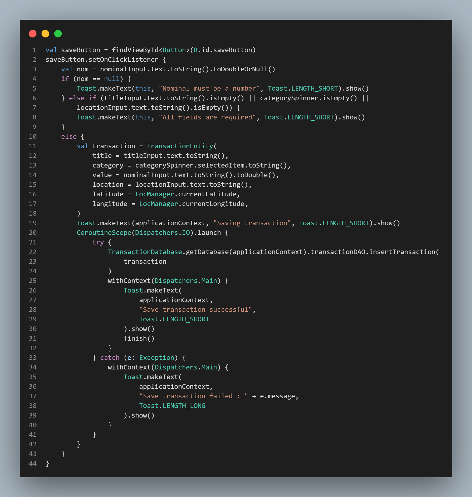
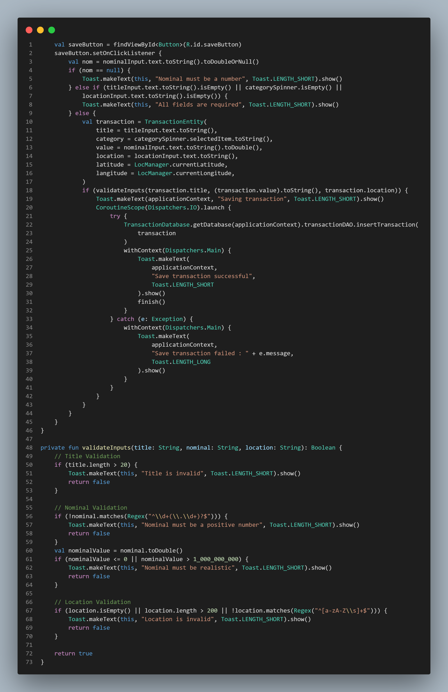
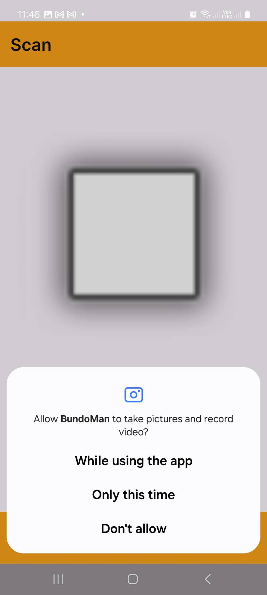
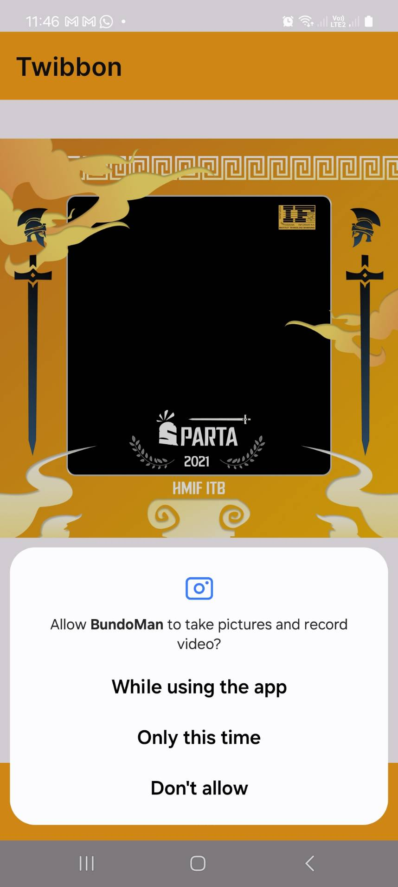
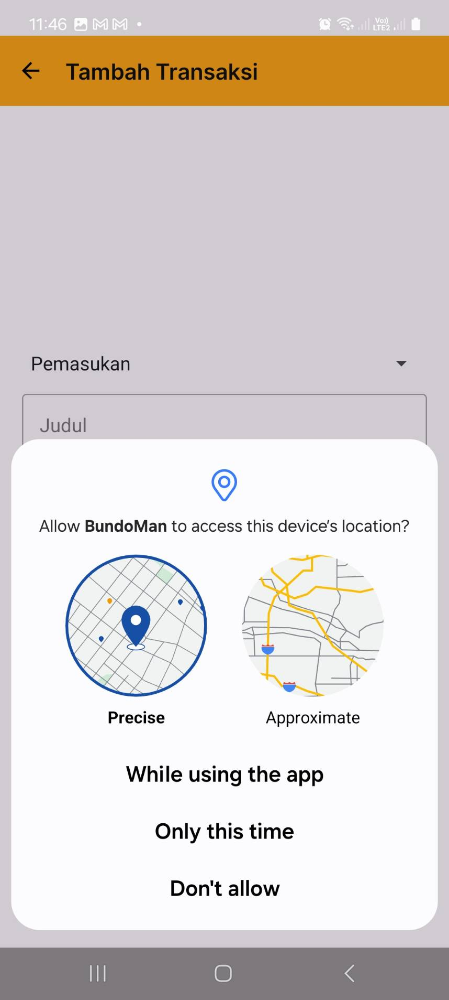

# IF3210-2024-Android-YGY

## Deskripsi

Bundoman merupakan sebuah aplikasi Android manajemen uang. Pengguna dapat melakukan penambahan, pengubahan, dan penghapusan transaksi.Pengguna juga dapat melihat daftar transaksi yang sudah dilakukan, serta melakukan scan nota. Setelah itu, pengguna dapat melihat graf rangkuman transaksi dan menyimpan daftar transaksi dalam format .xlsx pada halaman pengaturan.

Pembuatan Aplikasi Bundoman ditujukan untuk memenuhi Tugas Besar 1 IF3210 - Pengembangan Aplikasi pada Platform Khusus

## Library

Berikut adalah library yang kami gunakan untuk membangun Aplikasi Bundoman

- Core KTX: `androidx.core:core-ktx`
- AppCompat: `androidx.appcompat:appcompat`
- Material Components: `com.google.android.material:material`
- Activity KTX: `androidx.activity:activity-ktx`
- ConstraintLayout: `androidx.constraintlayout:constraintlayout`
- RecyclerView: `androidx.recyclerview:recyclerview:1.3.0`
- Lifecycle Runtime KTX: `androidx.lifecycle:lifecycle-runtime-ktx`
- Navigation Fragment KTX: `androidx.navigation:navigation-fragment-ktx`
- Navigation UI KTX: `androidx.navigation:navigation-ui-ktx`
- Room Runtime: `androidx.room:room-runtime:2.6.1`
- Room Compiler: `androidx.room:room-compiler:2.6.1`
- Room KTX: `androidx.room:room-ktx:2.6.1`
- Room Common: `androidx.room:room-common:2.6.1`
- Room Testing: `androidx.room:room-testing:2.6.1`
- Coroutines Android: `org.jetbrains.kotlinx:kotlinx-coroutines-android:1.5.0`
- Coroutines Core: `org.jetbrains.kotlinx:kotlinx-coroutines-core:1.5.0`
- Camera Core: `androidx.camera:camera-core:1.1.0-alpha06`
- Camera Camera2: `androidx.camera:camera-camera2:1.1.0-alpha06`
- Camera Lifecycle: `androidx.camera:camera-lifecycle:1.1.0-alpha06`
- Camera View: `androidx.camera:camera-view:1.0.0-alpha26`
- Apache POI: `org.apache.poi:poi:5.2.2`
- Apache POI OOXML: `org.apache.poi:poi-ooxml:5.2.2`
- Retrofit: `com.squareup.retrofit2:retrofit:2.9.0`
- Retrofit Converter Moshi: `com.squareup.retrofit2:converter-moshi:2.9.0`
- Moshi: `com.squareup.moshi:moshi:1.15.0`
- Moshi Kotlin: `com.squareup.moshi:moshi-kotlin:1.15.0`
- Work Runtime KTX: `androidx.work:work-runtime-ktx:2.9.0`
- Play Services Location: `com.google.android.gms:play-services-location:18.0.0`
- JUnit: `testImplementation`
- AndroidX JUnit: `androidx.test.ext:junit`
- Espresso Core: `androidx.test.espresso:espresso-core`
- Compose Testing: `androidx.compose.ui:ui-test-junit4`
- UI Tooling: `androidx.ui:ui-tooling`
- UI Test Manifest: `androidx.ui:ui-test-manifest`
- MPAndroidChart: `com.github.PhilJay:MPAndroidChart:v3.1.0`

## Screenshot
<table width="100%">
  <tbody>
    <tr>
      <td width="1%"></td>
      <td width="1%"></td>
       <td width="1%"></td>
    </tr>
    <tr>
      <td width="1%"></td>
      <td width="1%"></td>
       <td width="1%"></td>
    </tr>
    <tr>
      <td width="1%"></td>
      <td width="1%"></td>
      <td width="1%"></td>
    </tr>
  </tbody>
</table>

## Analisis dan Mitigasi Kerentanan OWASP

### M4: Insufficient Input/Output Validation

**Definisi**
Insufficient Input/Output Validation mengacu pada kegagalan aplikasi dalam memverifikasi, membersihkan, atau membatasi input dan output data dengan benar. Ini dapat menyebabkan sejumlah isu keamanan termasuk cross-site scripting (XSS), injection attacks, dan pengeksposan informasi sensitif. Input yang tidak divalidasi dari sumber yang tidak dipercaya dapat digunakan oleh penyerang untuk memanipulasi aplikasi dan mengakses atau menghancurkan data.

**Cara Prevent**

1. Validasi Input
2. Sanitasi Data
3. Encode Output
4. Impplementasi Kontrol Tipe Data
5. Penggunaan Parameterized Queries
6. Error Handling yang Baik

**Perbaikan**
Mekanisme perbaikan validasi input pada aplikasi meliputi peningkatan pada validasi email, password, judul, nominal, dan lokasi untuk meningkatkan keamanan dan integritas data. Untuk email, digunakan regex yang memastikan format email valid. Password diperkuat dengan regex untuk memenuhi kriteria tertentu, seperti keberadaan angka, huruf besar, dan karakter khusus, serta membatasi password dengan format khusus `password_{nim}`. Judul transaksi harus merupakan string yang tidak kosong dengan batasan panjang karakter yang wajar. Nominal harus berupa angka positif murni, divalidasi melalui regex yang memastikan hanya angka yang diperbolehkan, dan cek tambahan untuk memastikan nominal berada dalam rentang yang realistis. Lokasi divalidasi untuk hanya mengandung huruf alfabet dan spasi, menggunakan regex untuk mencegah input numerik atau karakter khusus.

| TOPIK            | SEBELUM                                                              | SESUDAH                                                              |
| ---------------- | -------------------------------------------------------------------- | -------------------------------------------------------------------- |
| LOGIN            |            |            |
| Tambah Transaksi |  |  |

### M8: Security Misconfiguration

**Definisi**
Security Misconfiguration adalah ketika aplikasi, database, server web, atau platform terkait tidak dikonfigurasi dengan tepat untuk keamanan. Ini terjadi ketika pengaturan keamanan tidak ditetapkan atau diimplementasikan dengan benar, default yang tidak aman dibiarkan, atau ketika konfigurasi yang tidak aman dapat diakses atau dieksploitasi. Misconfiguration dapat terjadi di berbagai level dari stack teknologi aplikasi, dan seringkali merupakan hasil dari pengaturan yang tidak lengkap, konfigurasi default, header HTTP yang tidak aman, pesan kesalahan yang mendetil, update server yang terlambat, dan sebagainya.

**Cara Prevent**

1. Pengaturan Keamanan yang Tepat
2. Automasi Pengecekan Konfigurasi
3. Prinsip Akses Terkecil
4. Update dan Patching
5. Environment Seperation
6. Revew dan Audit Berkala

**Perbaikan**
Mekanisme perbaikan yang telah dilakukan adalah selalu meminta izin yang digunakan dalam aplikasi kami, termasuk Camera, dan berbagai akses penyimpanan dan lokasi, serta memastikan bahwa semua izin tersebut diperlukan. Kami juga mengetahui bahwa token yang digunakan sudah di enkripsi di backend untuk memastikan keamanan. Untuk pengelolaan sesi, kami telah mengimplementasikan mekanisme otomatis yang memeriksa token setiap lima menit dan logout pengguna jika token telah kedaluwarsa, serta memastikan permintaan dengan token kedaluwarsa ditolak oleh server.

| TOPIK            | JENIS    | Bukti                                                      |
| ---------------- | -------- | ---------------------------------------------------------- |
| Scan             | CAMERA   |             |
| Twibbon          | CAMERA   |          |
| Tambah Transaksi | LOCATION |  |

### M9: Insecure Data Storage

**Definisi**
Insecure Data Storage merujuk pada kelemahan keamanan yang terjadi ketika data sensitif atau krusial disimpan tanpa enkripsi yang memadai atau perlindungan keamanan lainnya, sehingga berpotensi dapat diakses oleh aktor yang tidak berwenang seperti malware atau penyerang yang mendapatkan akses fisik ke perangkat. Data yang dimaksud bisa berupa kredensial pengguna, data personal, log transaksi, atau informasi keuangan yang jika bocor bisa mengakibatkan pencurian identitas, fraud keuangan, dan pelanggaran privasi.

**Cara Prevent**

1. Gunakan Enkripsi yang Kuat
2. Hindari Penyimpanan Data Sensitif
3. Security by Design
4. Data Obfuscation
5. Access Controls
6. Regular Security Audits
7. Use Secure Containers

**Perbaikan**
Dalam meningkatkan keamanan penyimpanan data aplikasi, kami telah menerapkan serangkaian perbaikan yang memfokuskan pada validasi input, penggunaan Room Database, dan keamanan file. Kami memastikan semua input divalidasi secara ketat untuk mencegah penyimpanan data berbahaya. Room Database digunakan untuk mengelola operasi database dengan lebih aman, menghindari risiko SQL Injection melalui penggunaan DAO. Untuk penyimpanan file, seperti dokumen Excel dan proses pengiriman data melalui email, kami memastikan data disimpan dan dikirimkan dengan cara yang aman, termasuk penggunaan lokasi penyimpanan yang privat dan protokol transfer data yang aman. Kami juga menghindari penyimpanan data sensitif dalam SharedPreferences tanpa enkripsi dan mempertimbangkan penggunaan Android Keystore untuk manajemen kunci yang aman.

## Pembagian Kerja dan Jumlah Jam Persiapan Anggota Kelompok

| NIM      | Nama                      | Pembagian Pekerjaan                                                          | Jumlah jam persiapan dan pengerjaan |
| -------- | ------------------------- | ---------------------------------------------------------------------------- | ----------------------------------- |
| 13521071 | Margaretha Olivia Haryono | Header, Navigation Bar, Login, Setting, Graf, Splash Screen,                 | 40                                  |
| 13521084 | Austin Gabriel Pardosi    | Room Repository, Twibbon, xlsx, CRUD transaksi, OWASP Analisis               | 40                                  |
| 13521172 | Nathan Tenka              | API Backend Integration, Scan, Mail, JWT, Deteksi Sinyal, Broadcast Receiver | 40                                  |
