<div align="center">


# BondoMan

**Transaction logging for raw material trades, built natively for Android.**


[About](#-about) •
[Features](#-features) •
[Screenshots](#-screenshots) •
[Tech Stack](#%EF%B8%8F-tech-stack) •
[Getting Started](#-getting-started) •
[Security](#%EF%B8%8F-security-owasp-mobile-top-10) •
[Team](#-team)

</div>

---

## 📖 About

BondoMan is a transaction logging application designed for raw material trades, developed using Kotlin for native Android.

Users can record income and expense transactions, scan receipts to log purchases automatically, review a summary chart, and export their records to Excel or send them by email. It was built as the first major project for **IF3210 – Platform-Specific Application Development**.

## ✨ Features

| | Feature | Description |
| :---: | --- | --- |
| 🔐 | **Authentication** | JWT login against the course backend. A background service watches token expiry and signs the user out when the session ends. |
| 📒 | **Transaction management** | Create, edit, and delete income/expense entries, stored locally with Room. |
| 📍 | **Location tagging** | The current city is filled in automatically using the fused location provider and the geocoder. |
| 🧾 | **Receipt scanning** | Capture a receipt with the camera or pick one from the gallery, upload it, review the detected items, and save them as a transaction. |
| 📊 | **Financial chart** | Pie chart comparing total income and total expenses. |
| 📤 | **Excel export** | Save every transaction as `.xlsx` or `.xls` to the Downloads folder. |
| ✉️ | **Email report** | Send the transaction list as an `.xlsx` attachment to the signed-in email address. |
| 🎲 | **Randomize input** | A broadcast from Settings pre-fills the Add Transaction form with a random title and amount. |
| 🖼️ | **Twibbon camera** | Live front-camera preview with a frame overlay, built on CameraX. |
| 📶 | **Connectivity awareness** | Detects network loss and shows a snackbar or a dedicated No Internet screen. |

## 📸 Screenshots

<table>
  <tr>
    <td align="center">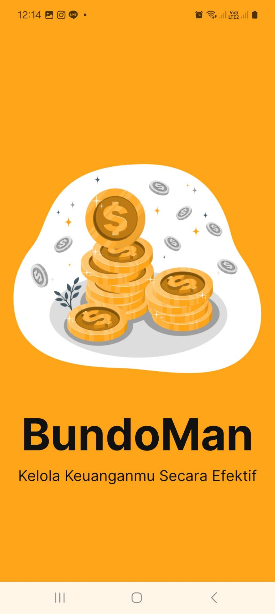<br /><sub><b>Splash</b></sub></td>
    <td align="center">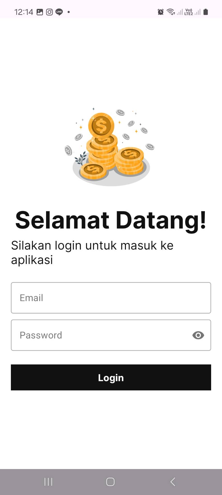<br /><sub><b>Login</b></sub></td>
    <td align="center">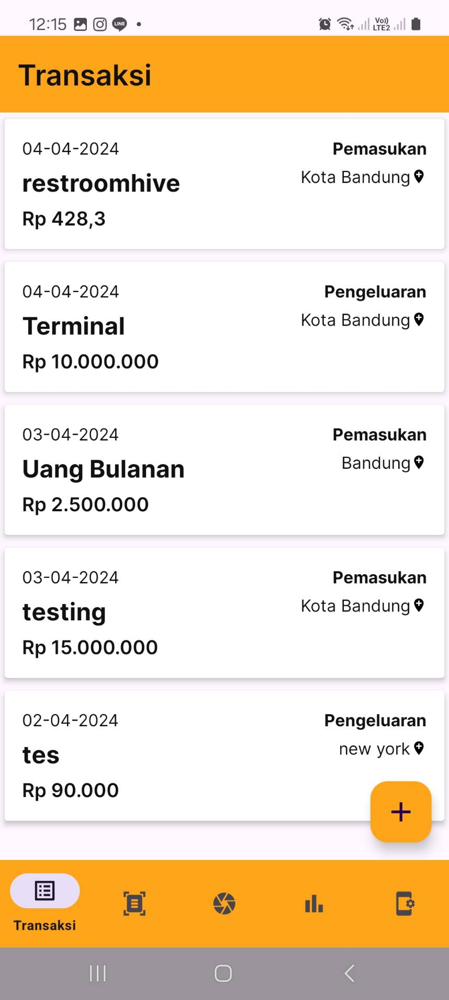<br /><sub><b>Transactions</b></sub></td>
  </tr>
  <tr>
    <td align="center">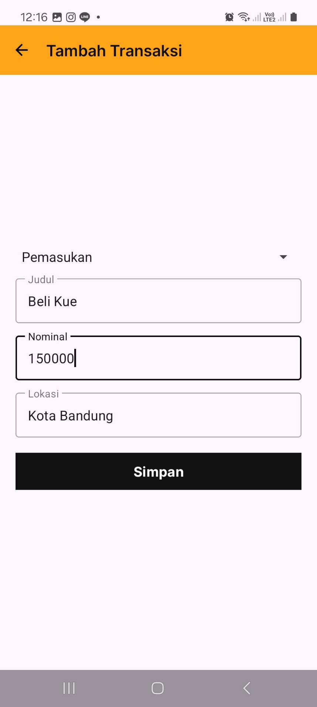<br /><sub><b>Add Transaction</b></sub></td>
    <td align="center">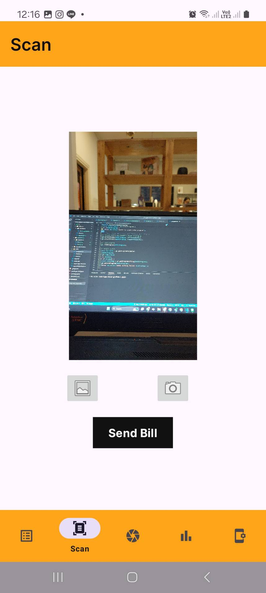<br /><sub><b>Scan Receipt</b></sub></td>
    <td align="center">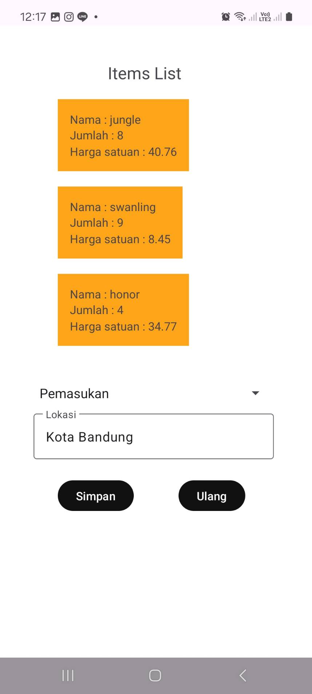<br /><sub><b>Scanned Items</b></sub></td>
  </tr>
  <tr>
    <td align="center">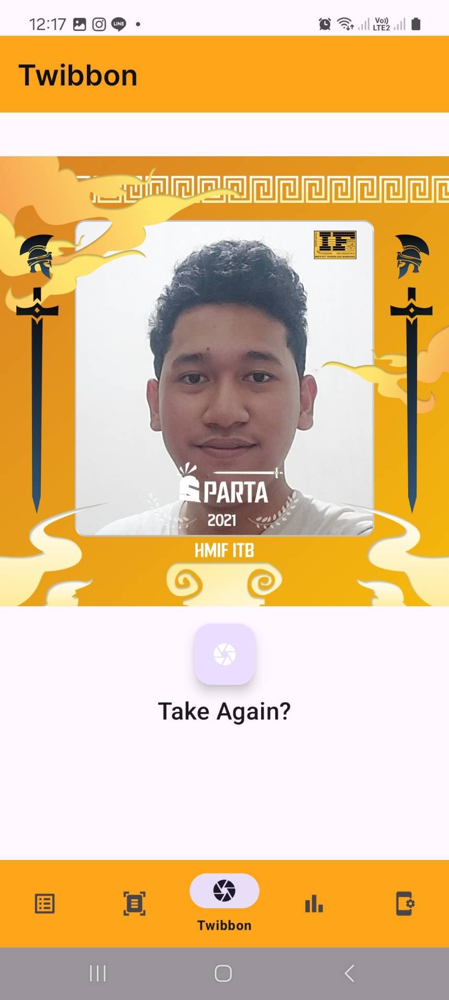<br /><sub><b>Twibbon</b></sub></td>
    <td align="center">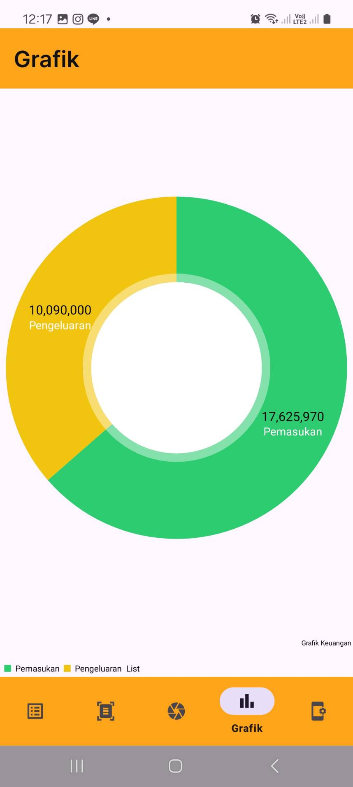<br /><sub><b>Chart</b></sub></td>
    <td align="center">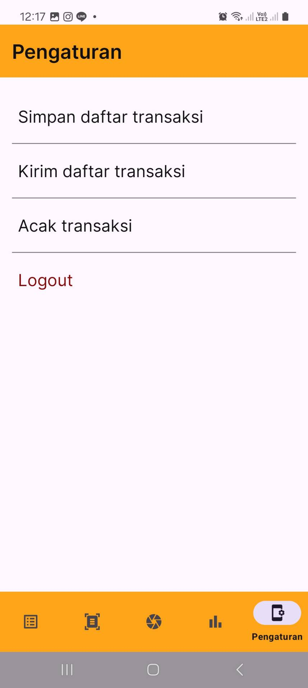<br /><sub><b>Settings</b></sub></td>
  </tr>
</table>

## 🛠️ Tech Stack

| Area | Libraries |
| --- | --- |
| **Language** | Kotlin |
| **UI** | AndroidX AppCompat, Material Components, ConstraintLayout, RecyclerView, View Binding |
| **Persistence** | Room `2.6.1` |
| **Networking** | Retrofit `2.9.0`, Moshi `1.15.0` |
| **Concurrency** | Kotlin Coroutines |
| **Camera** | CameraX `1.1.0-alpha06` |
| **Location** | Google Play Services Location `18.0.0` |
| **Charts** | MPAndroidChart `3.1.0` |
| **Export** | Apache POI `5.2.2` |
| **Testing** | JUnit, AndroidX Test, Espresso |

### Project Structure

```
app/src/main/java/com/example/bundoman/
├── adapter/        # RecyclerView adapter for scanned receipt items
├── models/         # API and domain models (User, Token, Item, Transaction)
├── repository/     # Wrappers around the API services and the Room DAO
├── room/           # Room database, entity, and DAO
├── service/        # Retrofit interfaces and the JWT expiry service
├── ui/             # List view model and the Twibbon fragment
└── *.kt            # Activities and fragments (Dashboard, Login, Scan, Grafik, Pengaturan, …)
```

### Backend API

The app talks to `https://pbd-backend-2024.vercel.app`:

| Method | Endpoint | Purpose |
| :---: | --- | --- |
| `POST` | `/api/auth/login` | Exchange email and password for a JWT |
| `POST` | `/api/auth/token` | Read the token's expiry time |
| `POST` | `/api/bill/upload` | Upload a receipt image and return the detected items |

## 🚀 Getting Started

### Prerequisites

- Android Studio Iguana (2023.2) or newer
- JDK 17
- An Android device or emulator running Android 8.0 (API 26) or later

### Installation

```bash
git clone https://github.com/AustinPardosi/Bundoman-Android-App.git
```

1. Open the project in Android Studio and let Gradle sync.
2. Select a device or emulator.
3. Click **Run ▶**.

Sign in with the account issued for the course backend. Passwords follow the format `password_<NIM>`.

## 🛡️ Security (OWASP Mobile Top 10)

The app was reviewed against three risks from the OWASP Mobile Top 10.

### M4 · Insufficient Input/Output Validation

Every form field is validated before it reaches the database or the network:

- **Email** must match Android's `Patterns.EMAIL_ADDRESS`.
- **Password** must match `password_` followed by an 8-digit student ID.
- **Title** is required and limited to 20 characters.
- **Amount** must be a positive number no greater than 1,000,000,000.
- **Location** may contain only letters and spaces, up to 200 characters.

| Screen | Before | After |
| --- | :---: | :---: |
| Login | 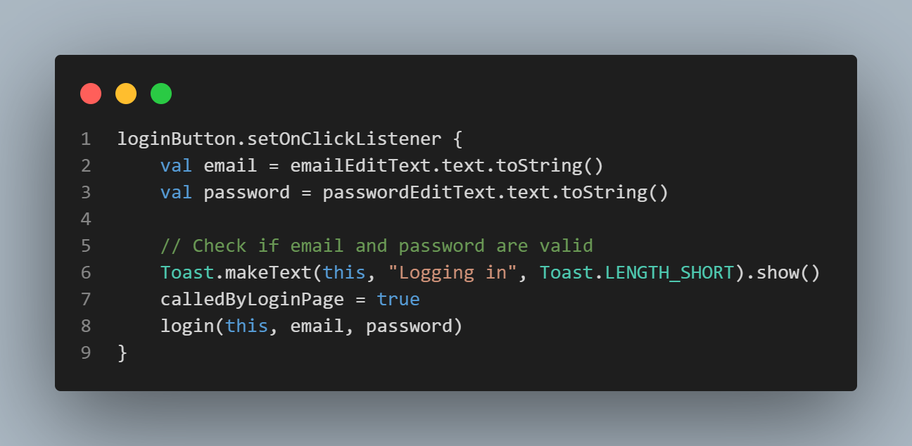 | 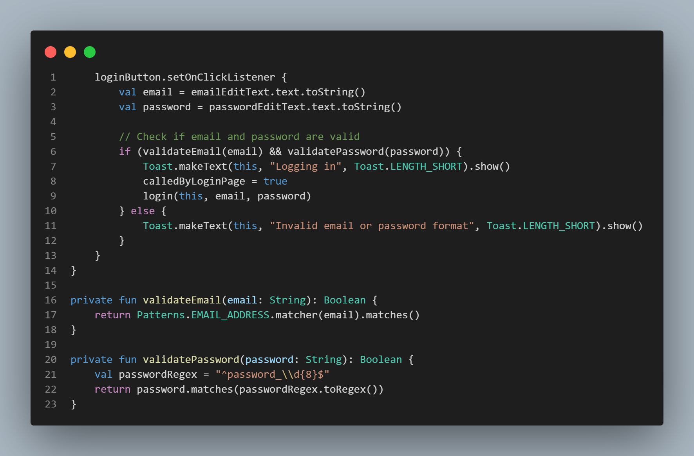 |
| Add Transaction | 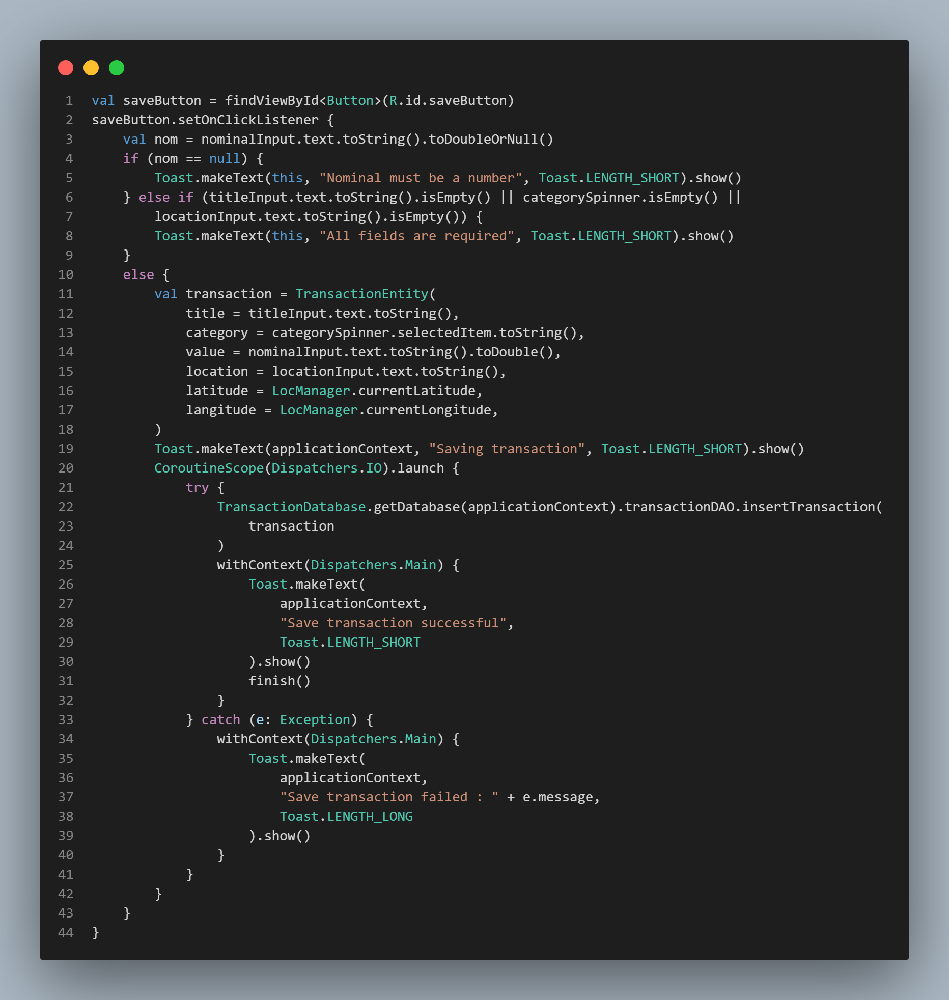 | 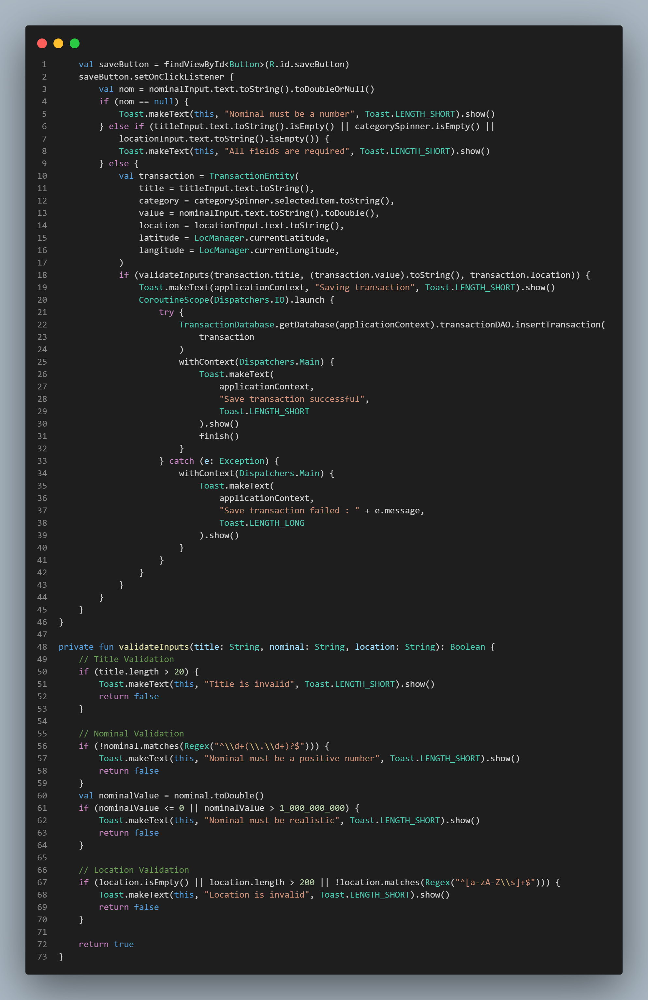 |

### M8 · Security Misconfiguration

- Camera and location permissions are requested at runtime, only when a feature needs them.
- A background service checks the JWT's expiry and signs the user out once it has expired.

| Screen | Permission | Evidence |
| --- | :---: | :---: |
| Scan | Camera | 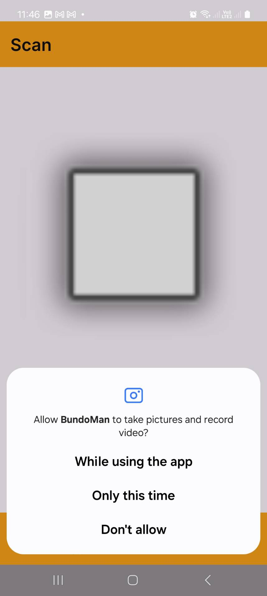 |
| Twibbon | Camera | 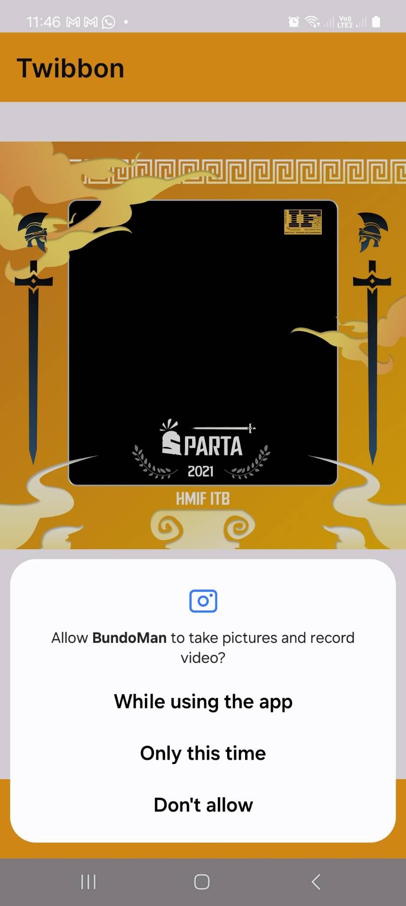 |
| Add Transaction | Location | 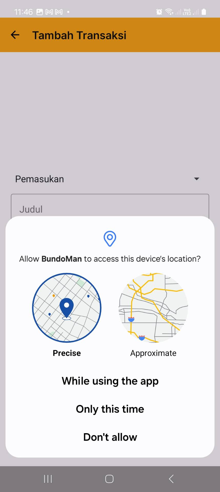 |

### M9 · Insecure Data Storage

- All database access goes through Room DAOs with bound parameters, so there is no raw SQL string building.
- Session data is kept in app-private `SharedPreferences` (`MODE_PRIVATE`).
- Exported files are shared through a `FileProvider` rather than as raw file paths.

## 👥 Team

| Name | Student ID | Contributions |
| --- | :---: | --- |
| Margaretha Olivia Haryono | 13521071 | Header, navigation bar, login, settings, chart, splash screen |
| [Austin Gabriel Pardosi](https://github.com/AustinPardosi) | 13521084 | Room repository, Twibbon, Excel export, transaction CRUD, OWASP analysis |
| Nathan Tenka | 13521172 | Backend API integration, receipt scanning, email, JWT, network detection, broadcast receiver |

<div align="center">
<sub>Built with Kotlin for IF3210 – Platform-Specific Application Development</sub>
</div>
